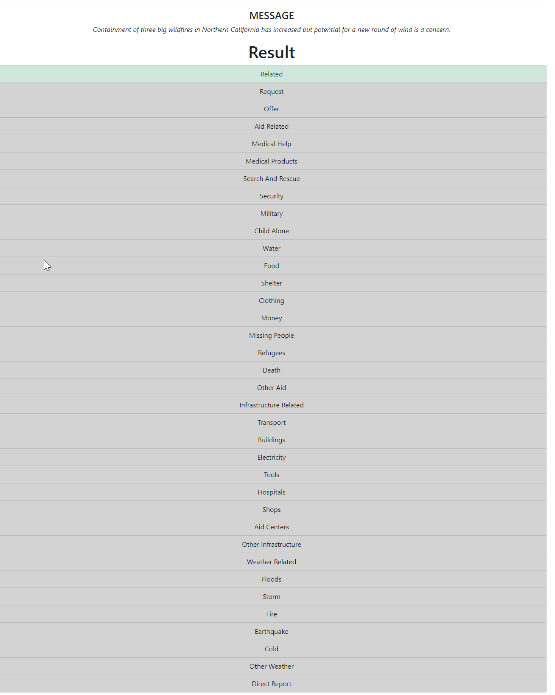

# Disaster Response Project

## Table of Contents
1. [Overview](#overview)
2. [Getting Started](#getting-started)	
	1. [Installation](#installation)
	2. [Executing Program](#execution)
	3. [Additional Material](#material)
3. [Project Details](#project-details)
    1. [Project structure](#project-structure)
    2. [ETL Pipeline](#etl-pipeline)
    3. [Train Classifier - Training of the Classifier](#train-classifier)        
4. [License](#license)
5. [Acknowledgement](#acknowledgement)
6. [Screenshots](#screenshots)

## Overview
This Repo contains the code for the "Disaster Response Project" which is the second prject of the Udacity Datascience Nanodegree.

It implements a message classification app that assigns a message to categories based on the message content (Word of bags).
The Project consists of the 3 parts:

* ETL Pipeline - Data cleaning and preparation
* ML part - Training of a classifier
* Web App - Simple application that allows user to enter a message and then assigns it ot categoires


## Getting Started

### Installation

#### 1. clone git repository
``` 
git clone https://github.com/step-bauer/udacity_datascience_prj_02.git
```

#### 2. create new virtual environment
```
conda -create -n <env_name> python=3.9

conda activate <env_name>

conda config --add channels conda-forge

conda install ptvsd pandas scipy scikit-learn matplotlib sqlalchemy joblib nltk flask plotly
```

for windows an alternative method is to use the conda-env-spec.txt
```
conda create -n py39_dresp --file conda-env-spec.txt
```

### Execution
change to main directory of the repository

#### 3.1 ETL Pipeline

```
python main.py etl-pipeline -mf ./data/disaster_messages.csv -cf ./data/disaster_categories.csv -db ./data/DisasterMsg.db
```

you can also call the ./data/process_pipline.py script directly and provide the three parameters (messages_filename:str, categories_filename:str, dbname:str)

#### 3.2 ML - Train Classifier
**Info** the train_classifier script can run very long on machines with a low number of CPUs. The script ran on a machine with 16 CPU for more than 2.5 hours.

```
python main.py ml-pipeline -mf ./models/classifier_model.joblib -db ./data/DisasterMsg.db -tbl DisasterMessages
```

or as an alternative call ./models/train_classifier
```
python ./models/train_classifier.py ./data/DisasterMsg.db ./models/classifier_model.joblib
```

#### Web App
```
python main.py run-web-app
```

## Project Details

### Project structure
The following outlines the main elements of the project structure

- main dir
    - data
        - disaster_messages.csv
        - disaster_categories.csv
        process.data.py
    - models
        train_classifier.py
    - prep
    - web
        - templates
        run.py
    - static
    main.py
    

use 
```
main.py -h 
```
to get help for the command line tool


### ETL Pipeline
The ETL pipeline will

* Load the messages and categories datasets
* Merge the two datasets
* Clean the data
* Store it in a SQLite database

The code is stored in ./data/process_data.py

### Train Classifier
The purpose of the train classifier part is to train a ML model to predict for a given messages the categroies it is related to.

The train_classifier.py uses Train Classifier and a GridSearch to determine the best classifier. The pipeline uses sckit-learn [TfidfVectorizer](https://scikit-learn.org/stable/modules/feature_extraction.html#text-feature-extraction) to convert a collection of raw documents to a matrix of TF-IDF features and then as an classifier for multi target classification [MultiOutputClassifier(RandomForestClassifier)](https://scikit-learn.org/stable/modules/generated/sklearn.ensemble.RandomForestClassifier.html). 
In order to find the best hyperparameters for the estimator I used [GridSearchSV](https://scikit-learn.org/stable/modules/generated/sklearn.model_selection.GridSearchCV.html) for a search over the following parameters


The considered parameters are

```
parameters = {
                                'tfidf_vect__tokenizer': (DisasterResponseModel.tokenize_lem,
                                                          DisasterResponseModel.tokenize),
                                'tfidf_vect__ngram_range': ((1, 1), (1, 2)),
                                'tfidf_vect__max_df': (0.50, 0.9),
                                'tfidf_vect__max_features': (3000,5000, 10000),
                                'clf__estimator__n_estimators' : (70,250)                                
                            }
```
|Parameter          | Description | 
|-------------------|-------------|
|Tokenizer          | the tokenizer that is used for tokenization of documents (messages) tokenize_lem uses a lemmatizer whereas tokenize doesn't |
| ngram_range       | defines the ngram range for TfIdfVecotrizer. (1,1) means that just unigrams (single words) are considered whereas (1,2) means unigrams and bigrams (sequences of two words) are considered. |
| max_df | When building the vocabulary ignore terms that have a document frequency strictly higher than the given threshold (corpus-specific stop words)|
|max_features |  vocabulary will only consider the top max_features ordered by term frequency across the corpus. |
|n_estimator | number of estimators used by the RandomForrest |


#### Best Estimator
The GridSearchSv took on 16 CPU machine a few hours and determined the best estimator for the following parameters: 

```
Pipeline(steps=[('tfidf_vect',
                 TfidfVectorizer(max_df=0.9, max_features=4000,
                                 ngram_range=(1, 2),
                                 tokenizer=<function tokenize_lem at 0x7f45255e1d40>)),
                ('clf',
                 MultiOutputClassifier(estimator=RandomForestClassifier(n_jobs=-1)))])
```

The evaluation of the model gave the following results for test data set

```
                         precision    recall  f1-score   support

               related       0.81      0.97      0.88      5999
               request       0.86      0.51      0.64      1303
                 offer       0.00      0.00      0.00        34
           aid_related       0.76      0.64      0.70      3234
          medical_help       0.68      0.13      0.22       646
      medical_products       0.67      0.16      0.26       394
     search_and_rescue       0.66      0.10      0.17       217
              security       1.00      0.01      0.03       141
              military       0.61      0.07      0.12       245
           child_alone       0.00      0.00      0.00         0
                 water       0.84      0.51      0.64       518
                  food       0.80      0.74      0.77       874
               shelter       0.80      0.49      0.61       692
              clothing       0.67      0.23      0.34       121
                 money       0.60      0.02      0.04       166
        missing_people       1.00      0.01      0.02        83
              refugees       0.65      0.05      0.10       282
                 death       0.76      0.31      0.44       349
             other_aid       0.64      0.04      0.08      1050
infrastructure_related       0.33      0.00      0.00       511
             transport       0.67      0.13      0.22       340
             buildings       0.73      0.16      0.26       397
           electricity       0.60      0.02      0.04       157
                 tools       0.00      0.00      0.00        42
             hospitals       0.00      0.00      0.00        88
                 shops       0.00      0.00      0.00        40
           aid_centers       0.00      0.00      0.00       100
  other_infrastructure       0.00      0.00      0.00       327
       weather_related       0.84      0.72      0.77      2126
                floods       0.90      0.50      0.64       637
                 storm       0.75      0.63      0.69       710
                  fire       0.50      0.01      0.03        70
            earthquake       0.88      0.80      0.84       689
                  cold       0.82      0.06      0.11       156
         other_weather       0.77      0.06      0.12       420
         direct_report       0.84      0.42      0.56      1500

             micro avg       0.81      0.56      0.66     24658
             macro avg       0.60      0.24      0.29     24658
          weighted avg       0.76      0.56      0.59     24658
           samples avg       0.68      0.51      0.53     24658
```

The calcuated accuracy for the categories is due to the imbalance of the data set not very useful.
Accuracy Results Table
|Category| accuracy score|
|--------|---------------|
|related                  | 0.80733 |
|request                  | 0.90475 |
|offer                    | 0.99567 |
|aid_related              | 0.77028 |
|medical_help             | 0.92347 |
|medical_products         | 0.95390 |
|search_and_rescue        | 0.97364 |
|security                 | 0.98230 |
|military                 | 0.96957 |
|child_alone              | 1.00000 |
|water                    | 0.96142 |
|food                     | 0.95008 |
|shelter                  | 0.94486 |
|clothing                 | 0.98637 |
|money                    | 0.97899 |
|missing_people           | 0.98956 |
|refugees                 | 0.96498 |
|death                    | 0.96485 |
|other_aid                | 0.86884 |
|infrastructure_related   | 0.93480 |
|transport                | 0.95963 |
|buildings                | 0.95441 |
|electricity              | 0.98013 |
|tools                    | 0.99465 |
|hospitals                | 0.98879 |
|shops                    | 0.99491 |
|aid_centers              | 0.98727 |
|other_infrastructure     | 0.95811 |
|weather_related          | 0.88667 |
|floods                   | 0.95518 |
|storm                    | 0.94779 |
|fire                     | 0.99109 |
|earthquake               | 0.97249 |
|cold                     | 0.98103 |
|other_weather            | 0.94894 |
|direct_report            | 0.87419 |


### Flask Web App

#### Run Web App

```
python main.py run-web-app
```

#### App Usage and description
This is a simple web application based on Flask to classify a given message. It uses the input message as input for the models predict method to determine the categories the message is related to.


#### Example
Below are some examples of classified messages taken from https://www.usnews.com/topics/subjects/natural_disasters on 5th of July 2021


**Input**: A ramped-up rescue effort at the collapsed South Florida condo building is facing new threats from the weather as a tropical storm approaches the state.

Result:


**Input**: Containment of three big wildfires in Northern California has increased but potential for a new round of wind is a concern.

Result 



**Input**: Rescue workers are digging through sludge and debris looking for more than 20 people who may be trapped after mud, trees and rocks ripped with a roar through a Japanese seaside resort.


**Input**: Philippine troops found the last five dead from the crash of a transport aircraft in the south, raising the death toll to 50 in the military's worst air disaster, officials said Monday.


